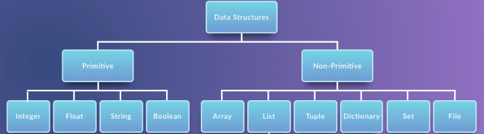

# Abstract Data Type and Data Structures
* Data structures are a way of organizing and storing data so that they can be accessed and worked with efficiently. 
They define the relationship between the data, and the operations that can be performed on the data.

* Data structures are actually an implementation of Abstract Data Types or ADT.
  This implementation requires a physical view of data using some collection of programming constructs and basic data types.
  
* Generally, data structures can be divided into two categories in computer science: primitive and non-primitive data structures.

## Primitive Data Structures  
* Integers
* Float
* Strings
* Boolean   
    
## Non-Primitive Data Structures 
   * Lists
   * Tuples
   * Dictionary
   
##### Lists:
* append()	-> Add Single Element to The List
* extend()	-> Add Elements of a List to Another List
* insert()	-> Inserts Element to The List
* remove()	-> Removes Element from the List
* index()	-> returns smallest index of element in list
* count()	-> returns occurrences of element in a list  
* len()	    -> Returns Length of an Object
* max()	    -> returns largest element
* min()  	-> returns smallest element
* sort()	-> returns sorted list from a given iterable

##### Tuples:
* count()	-> returns occurrences of element in a tuple
* index()	-> returns smallest index of element in tuple
* len()	    -> Returns Length of an Object
* max()	    -> returns largest element
* min()	    -> returns smallest element
* sorted()	-> returns sorted list from a given iterable
* sum()	    -> Add items of an Iterable

##### Dictionary:
* clear()	-> Removes all the elements from the dictionary
* copy()	-> Returns a copy of the dictionary
* get()	-> Returns the value of the specified key
* items()	-> Returns a list containing a tuple for each key value pair
* keys()	-> Returns a list containing the dictionary's keys
* values()	-> Returns a list of all the values in the dictionary

